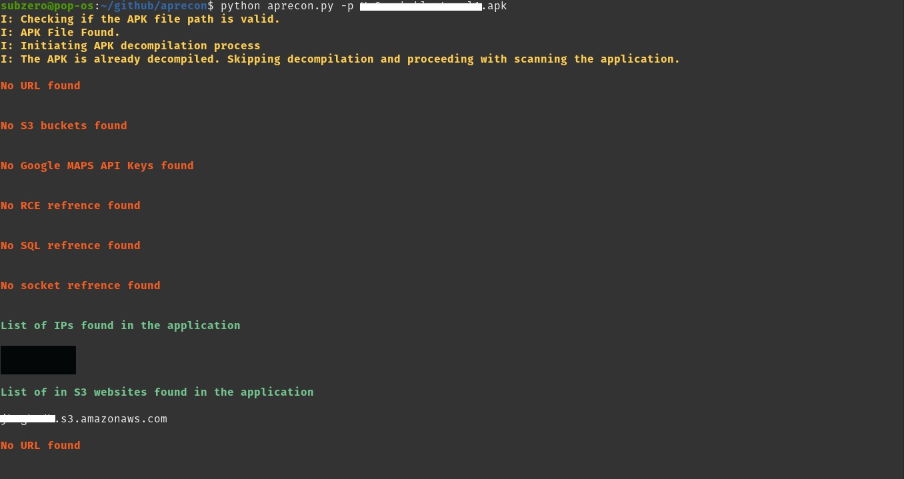

# ApRecon
 Aprecon is a Python based automation for static analysis and enumeration of andriod apk for finding 
  -IP addreses
  -S3 buckets
  -S3 websites
  -RCE references
  -SQL databases
  

## Installation

No installations required.

## Usage

```python
python aprecon.py -p <name>.apk
```



## License
[MIT](https://choosealicense.com/licenses/mit/)
